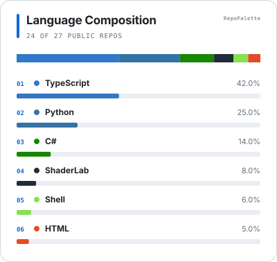
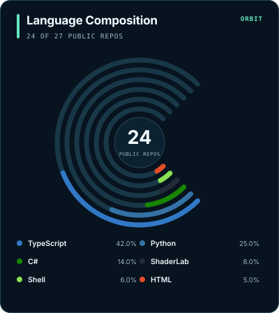
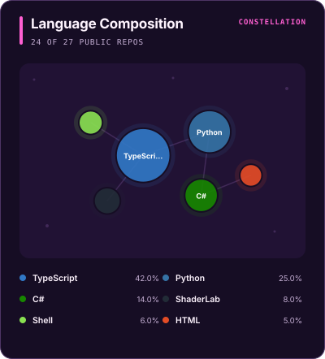

# RepoPalette

[English](README.md)

[](https://github.com/onovich/RepoPalette/actions/workflows/ci.yml)
[](https://github.com/onovich/RepoPalette/releases)
[](LICENSE)

选择一种布局和主题，根据你的公开 GitHub 仓库生成编程语言构成图。

RepoPalette 按计划自动运行，并把 SVG 和审计数据保存在你自己的 Profile 仓库中。无需创建个人令牌、部署图片服务或注册其他账号。

| `bars` | `orbit` | `constellation` |
| --- | --- | --- |
|  |  |  |

[在画廊中比较全部六套主题。](docs/GALLERY.md)

## 它有什么不同？

- 三种专门设计的布局，同时保留准确的语言名称和百分比。
- 读取完整的公开仓库列表，不会在前几页之后悄悄停止统计。
- 生成文件归你自己的仓库所有，图片显示不依赖实时卡片服务。
- 可读的 JSON 会列出纳入和排除的仓库；更新失败时，上一份有效文件保持不变。

## 快速开始

在你的 GitHub Profile 仓库（`你的用户名/你的用户名`）中创建 `.github/workflows/repopalette.yml`：

```yaml
name: Update RepoPalette

on:
  workflow_dispatch:
  schedule:
    - cron: "17 3 * * 1"

permissions:
  contents: write

jobs:
  update:
    runs-on: ubuntu-latest
    steps:
      - name: Check out profile repository
        uses: actions/checkout@3d3c42e5aac5ba805825da76410c181273ba90b1 # v7.0.1

      - name: Generate language chart
        id: repopalette
        uses: onovich/RepoPalette@339d87033bea46cdd9afb3d831cf4a336da26725 # v0.2.0 implementation
        with:
          style: orbit
          theme: aurora

      - name: Commit changes
        shell: bash
        env:
          SVG_PATH: ${{ steps.repopalette.outputs.svg-path }}
          DATA_PATH: ${{ steps.repopalette.outputs.data-path }}
        run: |
          git add -- "$SVG_PATH" "$DATA_PATH"
          if git diff --cached --quiet; then
            exit 0
          fi

          git config user.name "github-actions[bot]"
          git config user.email "41898282+github-actions[bot]@users.noreply.github.com"
          git commit -m "chore(profile): update RepoPalette"
          git push
```

然后：

1. 打开仓库的 **Actions** 页面，手动运行一次 **Update RepoPalette**。
2. 在 Profile 的 `README.md` 中加入 ``。

工作流会在每周一检查变化。正式发布后也可使用易读的 `@v0.2.0` 标签；对于拥有写权限的工作流，上方固定的完整提交 SHA 更安全。

## 自定义

修改 `with` 中的两个值：

- `style`：`bars`、`orbit` 或 `constellation`
- `theme`：`light`、`paper`、`midnight`、`aurora`、`terminal` 或 `neon`

你还可以调整标题、宽度、语言数量，以及仓库或语言筛选项。全部选项见 [`action.yml`](action.yml)。

## 统计范围

- 统计所选 GitHub 账号拥有的公开仓库。
- 排除 fork；默认排除归档仓库。
- 百分比基于 GitHub 提供的语言字节数。
- 图表不衡量熟练度、投入时间、代码质量或 AI 作者身份。

RepoPalette 还会生成 `assets/top-langs-data.json`，记录完整的统计范围。

## 开发

RepoPalette 需要 Node.js 24 或更高版本，并且没有运行时依赖。

```bash
npm run check
```

另见[版本记录](CHANGELOG.md)、[产品决策](docs/PRODUCT_DECISIONS.md)和 [MIT 许可证](LICENSE)。
