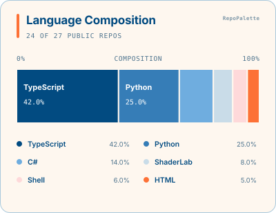

# RepoPalette

[English](README.md)

[](https://github.com/onovich/RepoPalette/actions/workflows/ci.yml)
[](https://github.com/onovich/RepoPalette/releases)
[](LICENSE)

为 GitHub Profile 生成一张会自动更新的编程语言构成图：视觉清晰，比例准确，不依赖在线图片服务。

RepoPalette 读取你的公开仓库，把 SVG 保存到 Profile 仓库，并在以后每周一检查变化。

只添加一个小文件、提交一次；不用注册其他账号，不用保管密钥，也不用部署图片服务。



## 快速开始

### 让 AI 安装

如果 AI 编程工具可以编辑你的 Profile 仓库，把下面这句话发给它：

> 在这个 GitHub Profile 仓库中安装 RepoPalette。按照 https://github.com/onovich/RepoPalette/blob/v0.4.0/docs/INSTALL_WITH_AI.md 操作，使用默认设置，并验证第一次自动运行。

安装说明已经写明该改什么、哪些内容不能碰，你不需要先学会 GitHub Actions。

### 自己安装

在 Profile 仓库（`你的用户名/你的用户名`）中新建 `.github/workflows/repopalette.yml`，粘贴以下内容：

```yaml
name: RepoPalette
on:
  workflow_dispatch:
  push:
    paths:
      - .github/workflows/repopalette.yml
  schedule:
    - cron: "17 3 * * 1"
permissions:
  contents: write
jobs:
  update:
    uses: onovich/RepoPalette/.github/workflows/profile.yml@9612810ee34ef9c33123b9149981b2ed0424669a # v0.4.0
```

<details>
<summary><strong>不熟悉 GitHub 的文件编辑器？</strong></summary>

打开你的 Profile 仓库，选择 **Add file → Create new file**，把 `.github/workflows/repopalette.yml` 填入文件名，粘贴上方内容，再选择 **Commit changes**。
</details>

提交文件即可。第一次提交会自动启动 RepoPalette；Actions 检查变绿时，图表已经加入 Profile README。此后每周一自动检查，也可以随时通过 **Actions → RepoPalette → Run workflow** 手动刷新。

发布后也可使用易读的 `@v0.4.0` 标签。上方固定的完整提交引用更适合拥有仓库写权限的工作流。

## 为什么选择 RepoPalette？

- **不只是常规横条卡片。** 十种布局兼顾视觉辨识度、完整语言名称和准确百分比。
- **Profile 不依赖实时图片服务。** 生成文件保存在你自己的仓库；以后某次更新失败，原图仍然可以显示。
- **统计结果可以核对。** 可读的数据文件会列出纳入和排除的仓库，不把统计范围藏起来。
- **安装保持简单。** 一份短工作流负责生成、验证、加入 README 和后续更新。

[在画廊中比较全部布局和主题。](docs/GALLERY.md)

## 常见问题

<details>
<summary><strong>我还没有 Profile 仓库，怎么办？</strong></summary>

[新建一个公开仓库](https://github.com/new?visibility=public)，仓库名必须与你的 GitHub 用户名完全相同，并勾选创建 README；然后按上方 Quick Start 操作。GitHub 会把这个 README 显示在你的 Profile 中。
</details>

<details>
<summary><strong>会统计什么？</strong></summary>

统计你本人拥有的公开仓库。排除 fork，默认排除归档仓库，百分比来自 GitHub 的语言字节数。以后新建的公开仓库会在下一次运行时自动加入。公开仓库连续 60 天没有仓库活动时，GitHub 可能暂停定时任务；遇到这种情况，在 Actions 中重新启用并手动运行一次即可。[查看说明](docs/ADVANCED_USAGE.md#troubleshooting-scheduled-updates)
</details>

<details>
<summary><strong>需要创建密钥或个人令牌吗？</strong></summary>

不需要。每次运行时，GitHub 会临时给工作流一张“通行证”，运行结束后自动失效。你不用创建或保管长期密钥，也不用注册其他账号或部署服务器。
</details>

<details>
<summary><strong>为什么需要写入权限？</strong></summary>

只用于把图表和数据保存到 Profile 仓库，并维护 `README.md` 中带标记的一小段内容。它不会修改被统计的其他仓库。
</details>

<details>
<summary><strong>它会评价编程能力或检测 AI 代码吗？</strong></summary>

不会。它只展示语言构成，不评价能力、投入时间、代码质量或作者身份。可选的 Manual/Vibe 双图也只是由你本人声明的分组。
</details>

## 需要更多控制？

默认使用 `ribbon` 布局和 `paper` 主题。先在[画廊](docs/GALLERY.md)中挑选样式，再通过[高级使用说明](docs/ADVANCED_USAGE.md)设置主题、筛选、标题、署名、Manual/Vibe 双图，或直接使用底层 Action。全部输入也可在 [`action.yml`](action.yml) 中查询。

参与开发需要 Node.js 24 或更高版本，可运行 `npm run check`。另见[版本记录](CHANGELOG.md)、[产品决策](docs/PRODUCT_DECISIONS.md)和 [MIT 许可证](LICENSE)。
