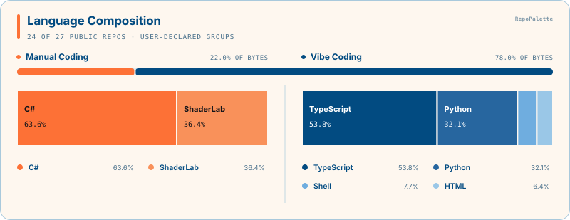
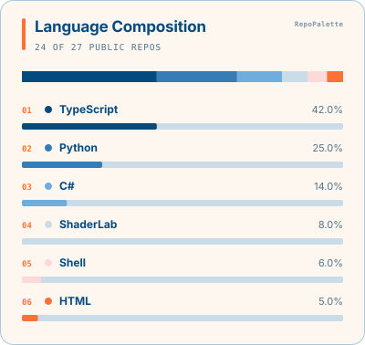
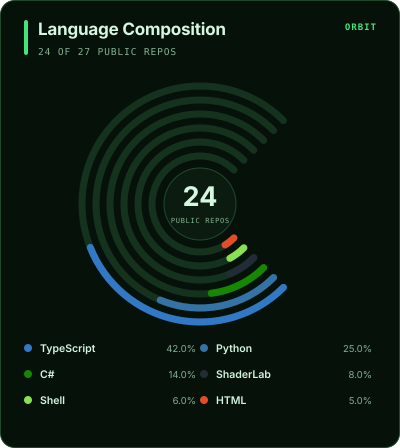
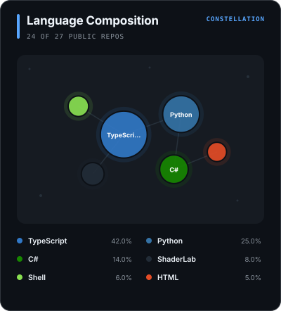
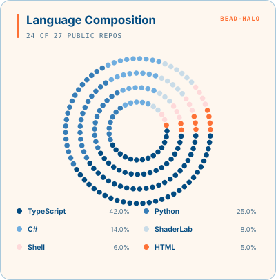
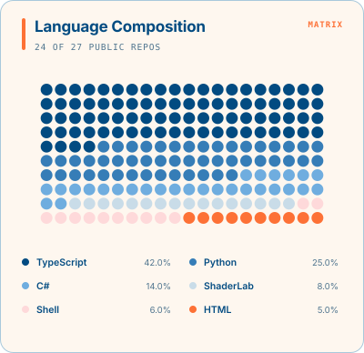
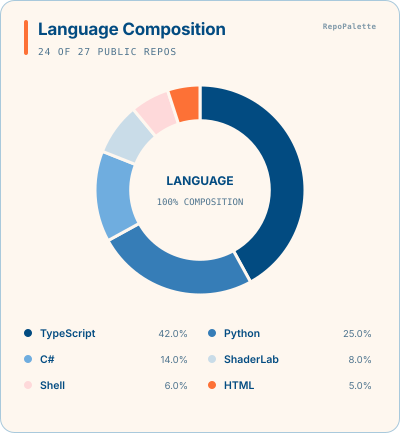
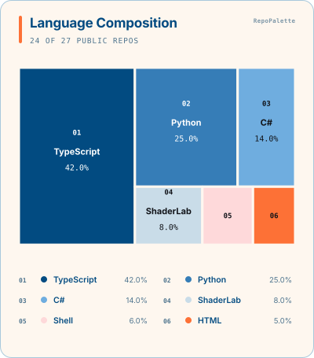
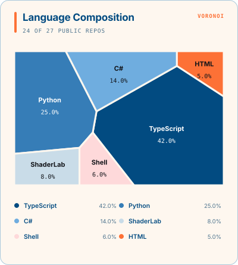
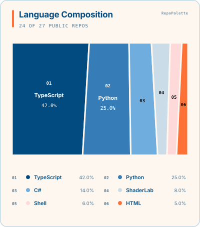

# RepoPalette gallery

[Back to README](../README.md)

Every preview below uses the same language data. Names and percentages remain exact; only the layout and theme change.

Layout names are kept outside the artwork. Each SVG shows the small default `RepoPalette` attribution, which can be disabled with `show-branding: false`.

## Optional coding-approach view

When the owner declares Manual and Vibe language groups, RepoPalette keeps them in one card. The shared rail shows the groups' overall byte share; each section then shows its own language composition.



## Layouts

- `bars` is the most direct ranking view.
- `orbit` gives each language its own radial track; it is not a pie or donut chart.
- `constellation` maps language share to node area and keeps exact values in the legend.
- `ribbon` is a compact, continuous 100% composition.
- `bead-halo` uses 200 equal units in a circular silhouette.
- `matrix` uses the same 200 equal units on a more analytical grid.
- `halo` is a contiguous donut with an exact legend.
- `treemap` emphasizes compact, directly labeled areas.
- `voronoi` uses deterministic proportional polygons for an expressive overview.
- `prism` keeps exact areas while giving the composition faceted boundaries.

| `bars` · `light` | `bars` · `paper` |
| --- | --- |
|  |  |

| `orbit` · `aurora` | `orbit` · `terminal` |
| --- | --- |
|  |  |

| `constellation` · `midnight` | `constellation` · `neon` |
| --- | --- |
|  |  |

| `ribbon` · `paper` | `bead-halo` · `paper` |
| --- | --- |
|  |  |

| `matrix` · `paper` | `halo` · `paper` |
| --- | --- |
|  |  |

| `treemap` · `paper` | `voronoi` · `paper` |
| --- | --- |
|  |  |

| `prism` · `paper` |
| --- |
|  |

## Choose a combination

All layouts work with all themes. Set the two Action inputs independently:

```yaml
with:
  style: constellation
  theme: midnight
```

Available themes: `light`, `paper`, `midnight`, `aurora`, `terminal`, and `neon`.

Closed composition layouts automatically add `Other` when the configured Top-N does not cover 100% of the language bytes.
