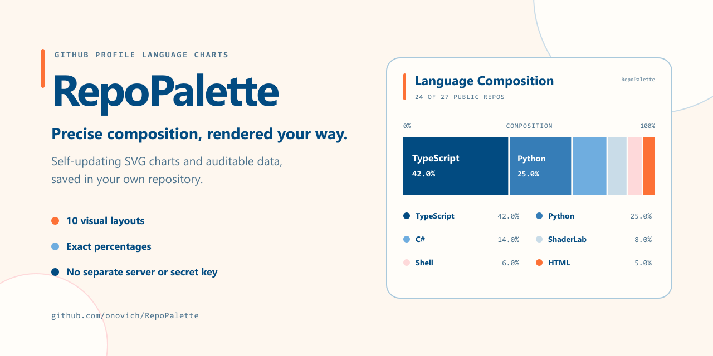
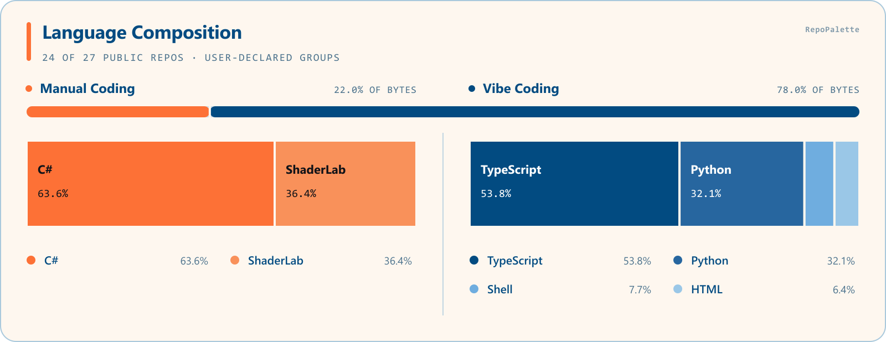

# RepoPalette launch kit

> Prepared 2026-08-13. These are review-ready drafts, not automatically published posts.

## Canonical links

- Repository: <https://github.com/onovich/RepoPalette>
- Marketplace: <https://github.com/marketplace/actions/repopalette>
- Release: <https://github.com/onovich/RepoPalette/releases/tag/v0.7.0>
- Live Profile demo: <https://github.com/onovich>
- Gallery: <https://github.com/onovich/RepoPalette/blob/main/docs/GALLERY.md>
- Chinese README: <https://github.com/onovich/RepoPalette/blob/main/README.zh-CN.md>

## Core positioning

**English:** RepoPalette turns public-repository language data into a self-updating GitHub Profile chart with exact percentages, auditable scope, and ten layouts—saved in your own repository.

**中文：** RepoPalette 把公开仓库的语言数据生成自动更新的 GitHub Profile 构成图：十种布局、准确百分比、可核对统计范围，文件直接保存在你的仓库中。

## Images

### Primary sharing image

Use for the repository link, general launch posts, and Marketplace announcements.

Suggested alt text:

> RepoPalette branding beside a precise GitHub Profile language-composition chart, with ten layouts, exact percentages, and repository-owned output highlighted.

### Product-difference image

Use when explaining the optional, user-declared Manual/Vibe grouping. It is not AI-code detection.

Suggested alt text:

> One RepoPalette chart combining user-declared Manual Coding and Vibe Coding language groups, with each group using a coordinated color family and exact percentages.

## General launch post — English

RepoPalette is now available on GitHub Marketplace.

It generates a self-updating language-composition chart for your GitHub Profile from your public repositories. You can choose from ten layouts, keep exact percentages visible, and inspect which repositories were included or excluded.

The SVG and audit data are saved in your own Profile repository, so the card does not depend on a live image service. The beginner setup is one small workflow file; no separate account, image server, or long-lived secret is required.

There is also an optional Manual/Vibe view, but it only uses groups you declare yourself—it does not claim to detect who or what wrote the code.

Try it: <https://github.com/onovich/RepoPalette>

Marketplace: <https://github.com/marketplace/actions/repopalette>

## 通用首发文案 — 中文

RepoPalette 已正式上架 GitHub Marketplace。

它会读取你的公开仓库，为 GitHub Profile 生成自动更新的编程语言构成图。可以从十种布局中选择，图上保留准确百分比，审计数据还会列出哪些仓库被纳入或排除。

生成的 SVG 和数据直接保存在你自己的 Profile 仓库中，因此不依赖实时图片服务。新手只需要添加一个很短的 workflow 文件，不用注册额外账号、部署图片服务器或保管长期密钥。

它还提供可选的 Manual/Vibe 合并视图，但分组完全由用户自己声明，不会冒充 AI 代码检测。

仓库：<https://github.com/onovich/RepoPalette>

Marketplace：<https://github.com/marketplace/actions/repopalette>

## Compact social copy — English

RepoPalette is live on GitHub Marketplace. Create a self-updating GitHub Profile language chart with 10 layouts, exact percentages, and auditable scope—saved in your repo. One small workflow; no extra account, server, or secret. <https://github.com/onovich/RepoPalette>

## 短社媒文案 — 中文

RepoPalette 已上架 GitHub Marketplace：为 GitHub Profile 生成自动更新的语言构成图，提供 10 种布局、准确百分比和可核对数据，文件直接保存在自己的仓库中。只需一份很短的 workflow，无需额外账号、图片服务器或长期密钥。<https://github.com/onovich/RepoPalette>

## Community post

Suggested titles:

- `Show: RepoPalette — self-updating GitHub Profile language charts stored in your own repository`
- `做了一个可自托管输出的 GitHub Profile 语言构成图 Action：RepoPalette`
- `RepoPalette: 10 composition-focused alternatives to the standard Profile language bar`

Suggested body structure:

1. Show the Social Preview or live Profile first.
2. State the problem in one sentence: common language cards offer limited visual choice or depend on a remote image endpoint.
3. State the implementation honestly: RepoPalette reads GitHub's public language-byte data and commits validated SVG plus audit JSON into the user's Profile repository.
4. List only the differentiators: ten layouts, exact percentages, auditable repository scope, repository-owned output, and no personal access token for public repositories.
5. Link the Quick start and ask for installation-friction feedback, not stars.
6. Disclose that Manual/Vibe grouping is user-declared and that token statistics are not implemented.

## Suggested first rollout

1. Keep the live chart linked from the author's Profile to the repository.
2. Publish one primary post in the maintainer's preferred language with the Social Preview.
3. Share the product-difference image only when the Manual/Vibe feature is relevant to the audience.
4. Invite five people to install it and record setup time, failure point, Profile URL, and whether the second update succeeds.
5. Avoid copying the same promotional text into many communities on the same day.

## Success notes template

| Tester | Public Profile | Started | First card | Second update | Setup minutes | Main friction | Showcase permission |
| --- | --- | --- | --- | --- | ---: | --- | --- |
| 1 |  |  |  |  |  |  |  |
| 2 |  |  |  |  |  |  |  |
| 3 |  |  |  |  |  |  |  |
| 4 |  |  |  |  |  |  |  |
| 5 |  |  |  |  |  |  |  |
